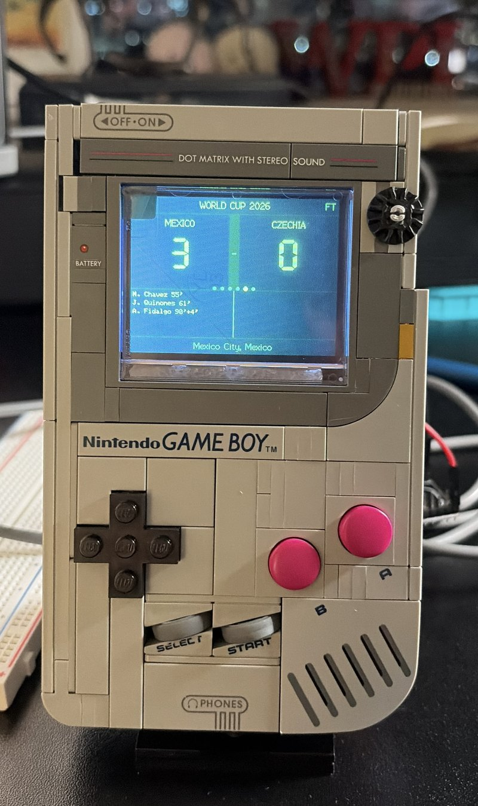

# LEGO Game Boy — Live World Cup Scoreboard

## Why I built this

I really enjoyed building the LEGO Game Boy set. Once I was done, I put it on my shelf and it looked nice but also a bit static. I wanted to change it and give it a purpose.

Around the same time, the World Cup was going on and it quickly became clear that I would not be able to watch every game, especially while at work. I wanted the set to be on my desk, quietly updating me on the current games without needing to check my phone all the time. I wanted updates on the scores, who scored, how much time is left and also to have an animation that would alert me when a goal was scored. The window on the LEGO Game Boy was the right size and shape to provide me with those kind of updates.

Turn the display window of the [LEGO Game Boy set (72046)](https://www.lego.com/product/game-boy-72046)
into a live scoreboard for the FIFA World Cup, powered by an ESP32 and a small SPI display. No soldering required if you buy parts with pre-soldered headers.




## What it does

- Polls [ESPN's public scoreboard feed](https://www.espn.com/soccer/scoreboard)
  once a minute and shows today's World Cup matches
- If a match is live, shows **only** live matches (auto-hides finished/upcoming ones)
- Displays the score, game clock, goal scorers (with own-goal handling), and venue
- Shows kickoff time for matches that haven't started yet
- Plays a pixel-art goal animation — a rotating ball arcs into a hand-drawn net —
  whenever a team's score increases
- Renders everything in the classic Game Boy DMG green palette

## Hardware

| Part | Notes | Approx. cost |
|---|---|---|
| ESP32 dev board (WROOM-32) | Any variant with Wi-Fi; pre-soldered headers recommended | $6–9 |
| 2.4" ILI9341 SPI display, 240×320 | 8-pin SPI, no touch needed | $9–13 |
| Female-to-female jumper wires | 8 needed | ~$5 |
| USB data cable | Match your board's port (Micro-USB or USB-C) — must be a *data* cable, not charge-only | $0–6 |
| (Optional) U.FL antenna | If your board is a "-U" variant with an external antenna connector and no antenna in the box | ~$7 |

Total: roughly $20–35 depending on what you already have.

## Wiring

The display uses landscape orientation (`tft.setRotation(3)`). Connect:

| Display pin | ESP32 GPIO |
|---|---|
| VCC | 3V3 *(not 5V — this can damage the display)* |
| GND | GND |
| SCK / SCL | GPIO 18 |
| SDI / SDA / MOSI | GPIO 23 |
| RES / RST | GPIO 4 |
| DC | GPIO 2 |
| CS | GPIO 15 |
| LED / BLK (backlight) | GPIO 32 |

Some display modules add a few extra pins for touch support (MISO, T_CLK, T_CS,
T_DI, T_DO) — these are unused here and can be left unconnected.

## Software setup

### 1. Install the Arduino IDE and ESP32 board support

- Install [Arduino IDE 2.x](https://www.arduino.cc/en/software)
- `File → Preferences → Additional boards manager URLs`, add:
  `https://espressif.github.io/arduino-esp32/package_esp32_index.json`
- `Tools → Board → Boards Manager`, search **esp32**, install **esp32 by Espressif Systems**

### 2. Install libraries

Via `Tools → Manage Libraries`:
- **TFT_eSPI** by Bodmer
- **ArduinoJson** by Benoit Blanchon (v6.x — not v7)

### 3. Configure TFT_eSPI

Edit `~/Documents/Arduino/libraries/TFT_eSPI/User_Setup.h` and replace its
contents with:

```cpp
#define ILI9341_DRIVER

#define TFT_WIDTH  240
#define TFT_HEIGHT 320

#define TFT_MOSI 23
#define TFT_SCLK 18
#define TFT_CS   15
#define TFT_DC    2
#define TFT_RST   4
#define TFT_BL   32
#define TFT_BACKLIGHT_ON HIGH

#define LOAD_GLCD
#define LOAD_FONT2
#define LOAD_FONT4
#define LOAD_FONT6
#define LOAD_FONT7
#define LOAD_FONT8
#define LOAD_GFXFF
#define SMOOTH_FONT

#define SPI_FREQUENCY 40000000
```

If your wiring uses different GPIO pins, update both this file and the wiring
table above to match.

### 4. Set up your config

```bash
cp config.h.example config.h
```

Edit `config.h` with your Wi-Fi network name, password, and timezone offset.
**`config.h` is gitignored** — it will never be committed, so your credentials
stay private even if you fork or push this repo.

> The ESP32 only connects to **2.4GHz** Wi-Fi networks, not 5GHz.

### 5. Upload

- `Tools → Board` → **ESP32 Dev Module**
- `Tools → Upload Speed` → **115200** (see troubleshooting below for why)
- `Tools → Port` → select your board's port
- Click Upload

## Troubleshooting

This project went through a *lot* of debugging to get the data fetch reliable.
Here's what we learned, in case you hit the same walls:

**Upload fails partway through with "the chip stopped responding"**
Lower `Tools → Upload Speed` to 115200. The default 921600 is too fast for
many ESP32 boards/cables to sustain through a full write, especially once the
sketch grows past a few hundred KB.

**Wi-Fi connects to nothing, or status code 6 every time**
Status 6 usually means a wrong password — but double check the SSID spelling
and case first ("2.4Ghz" ≠ "2.4GHz"). If you're on a hotel/office/managed
network, it may require a captive portal login that the ESP32 can't complete;
try a phone hotspot instead. iPhone hotspot names with a smart/curly apostrophe
(`Rodrigo's iPhone`) can also break the connection — rename the hotspot to
something with a plain ASCII name first.

**`Events in feed: 0` or `JSON error: IncompleteInput` / `InvalidInput`**
This is the big one. ESPN's response uses **chunked transfer encoding** and is
70–80KB — larger than the ESP32 HTTP client's internal `getString()` cap
(60KB), and the raw chunk-size headers (e.g. `0000C000\r\n`) get mixed into the
stream if you read it directly. The sketch handles this by reading the full
response into a heap buffer, locating the JSON's opening `{`, and stripping
chunk-boundary markers **in place** (no second buffer — that caused heap
fragmentation failures in earlier attempts). If you fork this and rewrite the
fetch logic, keep this in mind.

**`JSON error: NoMemory`**
The ArduinoJson document size is too small for the day's payload (more live
matches = more data). The sketch uses a filter to discard everything except
the ~15 fields it needs before they reach the document, which keeps memory use
low — but if ESPN adds events or you query a different sport/league with more
data, bump `DynamicJsonDocument doc(...)` up.

**Goal scorer names are blank**
If you're modifying the fetch logic: ArduinoJson's in-place parser stores
string values as *pointers into the original buffer*, not copies. If you
`free()` that buffer before you're done reading scorer names out of the
parsed document, you'll get garbage or empty strings. Free it only after
you've copied every value you need into your own structs.

**"No games today" when there clearly are games**
Check that NTP time sync succeeded (`Serial Monitor` should print `Current
time: ...`) — the date used in the API query comes from the synced clock, not
a hardcoded date. If the clock fails to sync, the query falls back to garbage
and returns nothing.

**Putting everything together**
Fitting the screen in the Lego Game Boy was tough. I had to remove a lot of pieces and replace some other ones so it would hold together. If you notice something off in the picture (like the volume knob in the front) that's probably why.

## Data source note

This uses ESPN's `site.api.espn.com` scoreboard endpoint, which is public and
requires no API key, but is **unofficial and undocumented** — it could change
or stop working without notice. If it does, you'll need to find a replacement
feed and adjust the JSON field paths in `fetchScores()` accordingly.

## Customizing

- **Different competition:** change the URL path in `fetchScores()`, e.g.
  `.../soccer/usa.1/scoreboard` for MLS, or any league ESPN covers.
- **Different colors:** edit the `GB_*` color defines near the top (RGB565 format).
- **Goal animation:** the ball pixel art, net bitmap, and arc physics are all
  in `playGoalAnimation()` and the constants above it — see the comments for
  how to retime or resize.
- **Refresh rate:** `FETCH_EVERY_MS` and `ROTATE_EVERY_MS` near the top control
  how often scores refresh and how long each match displays before rotating.

## License

MIT — see [LICENSE](LICENSE). Pixel art (ball and goal net) is original,
hand-drawn for this project.

## Credits

Built as a step-by-step learning project pairing a LEGO Game Boy set with an
ESP32. The original "make the LEGO Game Boy actually work" idea has prior art
from [Sebastian Staacks' open-source display mod](https://there.oughta.be/a/lego-game-boy)
and from commercial kits like BrickBoy and BlockBoy — this project takes a
different angle (a live data display rather than a game emulator) but the
LEGO disassembly and mounting techniques owe a debt to that earlier work.
